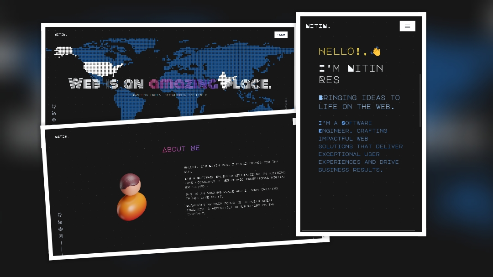

<h1 align="center">Here's what I've done</h1>

Hello 👋! I'm NITIN, this is my portfolio project, sharing my passion of creating beautiful and functional site. Feel free to look around.

## 🥤 Take a Tour 

Ready to see what I've been up to? Head over to [ntnr32.github.io/my-portfolio](https://ntnr32.github.io/my-portfolio/) to explore my portfolio site. From responsive designs to interactive elements, you'll find a variety of components that highlight my expertise and creativity.

##  🧑‍💻⚙️ Tech Stack
I've used the following technologies and frameworks to build my portfolio site:

- [Next JS]() for server-side rendering, static site generation, and dynamic routing
- [Tailwind CSS]() for efficient and responsive styling
- [Framer Motion]() for smooth and dynamic animations and transitions

## 🚵 Features to Discover 
My portfolio site offers a range of features designed to showcase my work and provide a seamless user experience, including:

- Responsive design optimized for mobile and desktop devices
- Modern and efficient styling using Tailwind CSS
- Smooth animations and transitions with Framer Motion
- Easy navigation to find your way around with ease
- Detailed project descriptions, screenshots, and links to live demos
- A contact link to get in touch with me for collaboration or freelancing
- Links to my social media profiles and GitHub repository

## 📽️ Project Tour

If you're interested in experimenting with the code or building your own portfolio site using Next JS, Tailwind CSS, and Framer Motion, you can:

- Clone this repository to your local machine
- Install the required dependencies using `"npm install"`
- Run the development server using `"npm run dev"`
- Explore, experiment, and have fun!

## 🤙 Let's Connect

I'm always looking to collaborate and connect with fellow web developers and tech enthusiasts. Feel free to reach out to me through the contact form, or connect with me on social media!

- [Github](https://github.com/ntnr32)
- [LinkedIn](https://www.linkedin.com/in/nitin-res)
- [Instagram](https://www.instagram.com/ntnr34)

## License

This project is licensed under the MIT License - see the LICENSE file for more information.